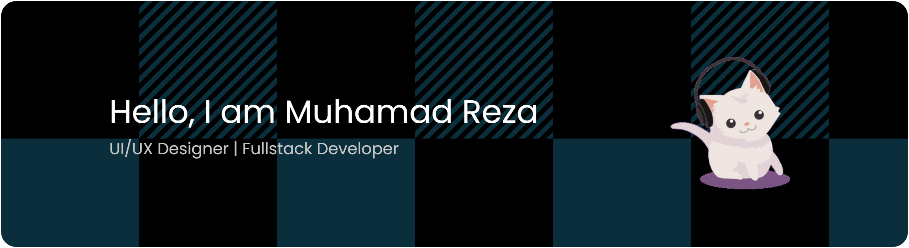

 I love playing in the world of technology. As a <b>UI/UX Designer</b>, I enjoy the process of designing clean, uncluttered, and user-friendly interfaces, with a focus on intuitive user experiences and modern aesthetics.

As a <b>Fullstack Developer</b>, I enjoy building systems from the frontend to the backend, transforming ideas into functional, efficient, and optimally performing applications. I enjoy the problem solving process and how each part of a system fits together.

<b>Skills and tools that I have mastered</b>

###

###

<b>Connect with me</b>

 
